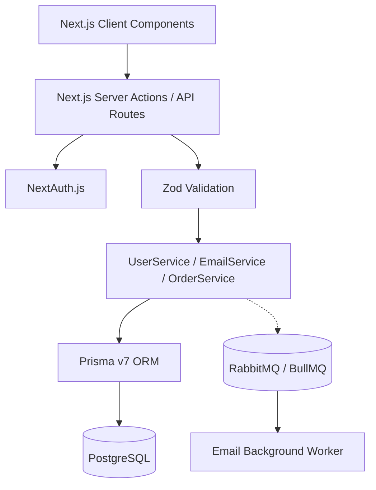

# Next Pizza v2.0 🍕

A premium full-stack pizza ordering platform built with modern web technologies. This project showcases **UI/UX Pro Max** aesthetics, **Clean Code** architecture, and **Node.js Backend Patterns** (OOP, Dependency Injection, Event Queues).


## Tech Stack

- **Framework**: [Next.js 16](https://nextjs.org/) (App Router)
- **Language**: [TypeScript](https://www.typescriptlang.org/)
- **Database**: PostgreSQL with [Prisma ORM v7](https://www.prisma.io/) + `@prisma/adapter-pg`
- **Styling**: [Tailwind CSS v4](https://tailwindcss.com/)
- **UI Components**: [shadcn/ui](https://ui.shadcn.com/) (Styled with UI/UX Pro Max tokens)
- **State Management**: [Zustand](https://zustand-demo.pmnd.rs/)
- **Message Broker**: [RabbitMQ](https://www.rabbitmq.com/) + [BullMQ](https://docs.bullmq.io/)
- **Authentication**: [NextAuth.js](https://next-auth.js.org/)
- **Validation**: [Zod](https://zod.dev/)

## Features

- **Product Catalog**: Browse pizzas, snacks, and drinks.
- **Advanced Filtering**: Filter by price range, pizza size, dough type, and ingredients.
- **Dynamic Sorting**: Sort products by popularity and price.
- **Customizable Pizzas**: Build your own pizza by toggling individual ingredients.
- **Shopping Cart**: Real-time cart updates and totals using Zustand.
- **Secure Checkout**: Form validation with Zod and secure order placement.
- **User Authentication**: Register and login securely using NextAuth.
- **User Profile**: View past orders and manage account details, including delivery/payment defaults.
- **Email Notifications**: Asynchronous background email delivery via RabbitMQ for profile updates and receipts.

## Architecture



## Getting Started

### Prerequisites
- Docker & Docker Compose
- Node.js 22+ (for local development without Docker)

### 1. Run with Docker Compose (Recommended)

The easiest way to get the app running, including the database, RabbitMQ, and seed data.

```bash
docker-compose up -d --build
```
This will start:
- **Web App**: `http://localhost:3000`
- **PostgreSQL Database**: `localhost:5433`
- **RabbitMQ**: `localhost:5672`
- **Redis (for BullMQ)**: `localhost:6379`
- **Meilisearch**: `localhost:7700`
- **Background Worker**: Node.js worker consuming queue jobs.

### 2. Local Development

1. Install dependencies:
   ```bash
   npm install
   ```

2. Copy environment file:
   ```bash
   cp .env.example .env
   # Make sure DATABASE_URL, REDIS_URL, etc., are properly set.
   ```

3. Generate Prisma Client & Push Schema:
   ```bash
   npx prisma generate
   npx prisma db push
   ```

4. Seed the database:
   ```bash
   npm run prisma:seed
   ```

5. Run development server:
   ```bash
   npm run dev
   ```

6. Start Background Worker:
   ```bash
   npm run worker
   ```

## Design Patterns

- **Clean Code & OOP**: All complex business logic is encapsulated in strongly-typed classes (e.g., `UserService`, `EmailService`) inside `lib/services/`.
- **Background Jobs**: Heavy tasks like sending emails are offloaded to BullMQ/RabbitMQ to guarantee fast API responses.
- **Centralized Providers**: All context providers grouped in `providers/index.tsx`.
- **API Error Handling**: Uses a robust higher-order `withApiHandler` wrapper in `lib/api-handler.ts`.
- **Driver Adapters**: Utilizing Prisma's newer `@prisma/adapter-pg` pattern for serverless edge compatibility.

## CI/CD

Configured via GitHub Actions:
- Type checking (`tsc --noEmit`)
- Linting (`eslint`)
- Build verification
- Docker `HEALTHCHECK` mapped to `/api/health`
